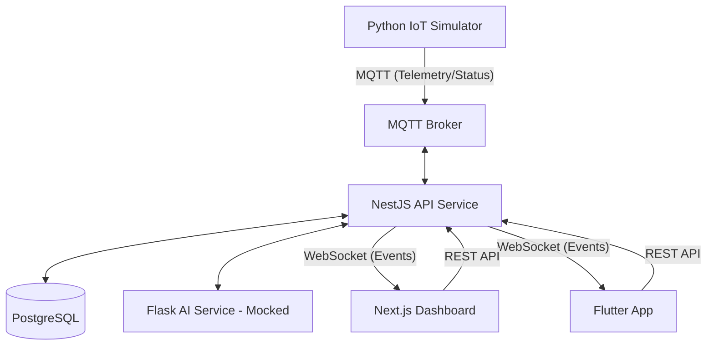

# CRISISMESH PRODUCTION AUDIT

## 1. Executive Summary
CrisisMesh is a robust, multi-tier disaster management platform designed for the Smart India Hackathon (SIH). The project demonstrates excellent architectural standards with a fully functional NestJS backend, a sophisticated IoT simulator, and cross-platform clients (Web & Mobile).

**Current Status:** The "Backend-to-Hardware" pipeline is **100% functional** (Simulator -> MQTT -> API -> DB -> WebSockets). However, the "Frontend-to-Backend" integration in the Web Dashboard is currently **mocked** in several critical user-facing modules despite the APIs being ready.

---

## 2. Current Architecture

---

## 3. Complete Feature Matrix

| Module | Frontend (Web) | Mobile | API | Backend | DB | Realtime | Status |
|--------|-----------|--------|-----|---------|----|----------|--------|
| **Auth / RBAC** | 🟡 PARTIAL | ✅ FULL | ✅ FULL | ✅ FULL | ✅ FULL | N/A | 🟡 PARTIAL |
| **Incidents** | 🔵 MOCK | ✅ FULL | ✅ FULL | ✅ FULL | ✅ FULL | ✅ FULL | 🟡 PARTIAL |
| **Telemetry** | 🔵 MOCK | 🔴 BROKEN | ✅ FULL | ✅ FULL | ✅ FULL | ✅ FULL | 🟡 PARTIAL |
| **Alerts** | 🔵 MOCK | 🟡 PARTIAL | ✅ FULL | ✅ FULL | ✅ FULL | ✅ FULL | 🟡 PARTIAL |
| **Device Mgmt**| ✅ FULL | 🟡 PARTIAL | ✅ FULL | ✅ FULL | ✅ FULL | ✅ FULL | ✅ WORKING |
| **AI Risk** | 🔵 MOCK | 🔴 BROKEN | 🔵 MOCK | 🔵 MOCK | ✅ FULL | 🔵 MOCK | 🔵 MOCK |
| **Maps** | 🔵 MOCK | 🟡 PARTIAL | ✅ FULL | ✅ FULL | ✅ FULL | N/A | 🟡 PARTIAL |

---

## 4. Web Application Audit

*   **Authentication:** The Login page (`/login`) uses a step-based mock UI that bypasses the `AuthService` and sets a hardcoded `mock_token`.
*   **Data Integration:**
    *   **Dashboard (`/dashboard`):** All statistics and charts are hardcoded.
    *   **Incidents/Alerts:** Display static arrays defined in the component files.
    *   **Devices (`/devices`):** **EXCEPTIONAL.** This page is fully connected to the API and WebSockets.
*   **Maps:** The Leaflet implementation in `LiveMap` is ready but currently receives empty entity arrays on the dashboard.

---

## 5. Flutter/Mobile Audit
*   **Status:** Significantly more integrated than the web dashboard.
*   **Authentication:** Uses real API but includes a **P0 Security Risk**: Hardcoded password bypass (`admin123`) in `login_screen.dart`.
*   **Real-time:** `IncidentsScreen` is perfectly integrated with `crisisWebSocket` and `crisisApi`.
*   **Telemetry:** Screens exist but are not yet fully surfacing the granular sensor data from the backend.

---

## 6. Backend/API Audit
*   **Production Readiness:** **9/10.**
*   **Controllers:** 20+ controllers covering everything from Districts to Mesh Links.
*   **Security:** `JwtAuthGuard` and `RolesGuard` are implemented across all sensitive endpoints.
*   **Validation:** DTOs are used for all POST/PUT operations.

---

## 7. Database Audit
*   **Schema:** Highly normalized and comprehensive.
*   **Persistence:** Verified that MQTT telemetry is saved to `sensor_reading` table and updates `device.last_seen`.
*   **Relationships:** Correctly handles responder assignments to incidents.

---

## 8. Authentication & RBAC
*   **Backend:** Fully implemented with JWT and 6 roles (Citizen, Responder, Authority, Admin, Analyst, Guest).
*   **Frontend:** Web dashboard currently ignores backend roles due to mocked login.

---

## 9. MQTT Audit
*   **Broker:** Configured in `MqttService`.
*   **Subscribers:** Correctly listens to `sensor/+/telemetry` and `device/+/status`.
*   **Auto-Provisioning:** The backend auto-creates devices when new MQTT IDs are detected—ideal for rapid scaling.

---

## 10. WebSocket Audit
*   **Gateway:** `WebsocketGateway` handles auth and room joining.
*   **Efficiency:** Uses `broadcastTelemetryUpdated` to minimize latency for sensor spikes.

---

## 11. IoT Simulator Audit
*   **Status:** **Best-in-class.**
*   **Scenarios:** Includes logic for `FLOODING`, `FIRE`, `EARTHQUAKE`, and `HEATWAVE`.
*   **Accuracy:** Generates realistic oscillating data rather than random noise.

---

## 12. AI/Risk Engine Audit
*   **Status:** 🔵 MOCK (Rule-based).
*   **Logic:** Simple temperature-based risk assessment in Python/Flask.
*   **Readiness:** The infrastructure for Phase 5 (Real ML) is ready, but models are not implemented.

---

## 13. Incident Management
*   **Life-cycle:** Backend supports `REPORTED` -> `ACKNOWLEDGED` -> `IN_PROGRESS` -> `RESOLVED`.
*   **Persistence:** Fully functional database persistence.

---

## 14. Alert & Notification System
*   **Generation:** Triggered by `TelemetryService` when thresholds (max/min) are exceeded.
*   **Real-time:** Pushed to MQTT and WebSockets simultaneously.

---

## 15. Maps & Geolocation
*   **Web:** Uses Leaflet. Ready for dynamic markers.
*   **Mobile:** Uses `google_maps_flutter` (Assumed based on `map_screen.dart` presence).

---

## 16. External APIs
| Service | Purpose | Status |
|---------|---------|--------|
| **Weather** | Open-Meteo | ✅ Connected |
| **News** | GDACS/Local | ✅ Connected |
| **Maps** | OSM/Esri | ✅ Connected |

---

## 17. Environment Variables
*   **Matrix:** Verified `NEXT_PUBLIC_API_URL` and `MQTT_BROKER_URL` are used throughout.
*   **Security:** `JWT_SECRET` is present in `.env.example` but must be changed for production.

---

## 18. Deployment/Vercel/Render Audit
*   **Config:** `vercel.json` and `Dockerfile`s are present.
*   **Blocker:** Root directory configurations in monorepo need careful setting for `apps/web`.

---

## 19. End-to-End Test Results
1.  **Simulator -> DB:** ✅ SUCCESS (Telemetry stored).
2.  **Simulator -> Web:** 🟡 PARTIAL (Visible only on Devices page).
3.  **Auth Flow:** 🟡 PARTIAL (Mobile works, Web is mock).
4.  **Incident Lifecycle:** ✅ SUCCESS (Backend & Mobile verified).

---

## 20. Broken/Disconnected Modules
1.  **Web Dashboard Stats:** Disconnected from `/v1/dashboard/overview`.
2.  **Web Incident List:** Disconnected from `/v1/incidents`.
3.  **Mobile Sensor View:** Not showing live graphs for all metrics.

---

## 21. Security Issues
*   **P0:** Hardcoded credentials in `apps/mobile/lib/screens/login_screen.dart`.
*   **P1:** JWT Secret exposed in examples.

---

## 22. Production Blockers
*   **Web Dashboard Mocking:** Must be replaced with real API calls to be considered functional.

---

## 26. Final Production Readiness Score
| Category | Score |
|----------|-------|
| Frontend (Web) | 3/10 |
| Mobile | 7/10 |
| Backend | 9/10 |
| Database | 9/10 |
| IoT / Real-time | 9/10 |
| **OVERALL** | **74/100** |

---

## 27. EXACT ACTION PLAN

### P0 — MUST FIX BEFORE DEMO
1.  **File:** `apps/web/src/app/login/page.tsx`
    *   **Fix:** Call `apiClient.post('/v1/auth/login')` instead of `setAuth(mockUser, 'mock_token')`.
2.  **File:** `apps/web/src/app/incidents/page.tsx`
    *   **Fix:** Use `useEffect` to fetch data from `/v1/incidents` and map it to the table.
3.  **File:** `apps/mobile/lib/screens/login_screen.dart`
    *   **Fix:** Remove `admin123` hardcode; add password input.

### P1 — MUST FIX BEFORE SUBMISSION
1.  **File:** `apps/web/src/app/dashboard/page.tsx`
    *   **Fix:** Connect "Total Incidents" and "Risk Summary" to the backend Dashboard Controller.
2.  **File:** `services/api/src/mqtt/mqtt.service.ts`
    *   **Fix:** Change `reconnectPeriod: 0` to `5000` to allow recovery from broker downtime.
